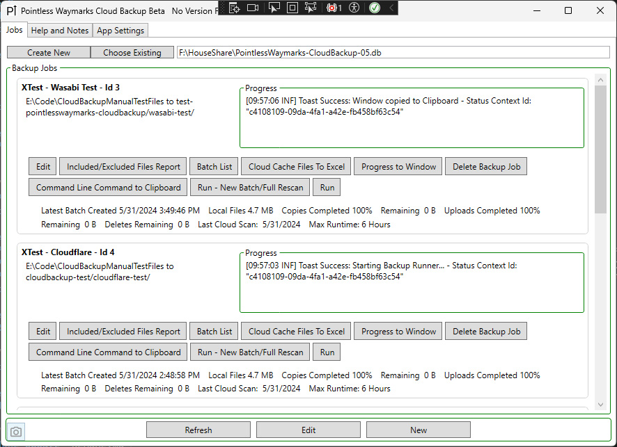
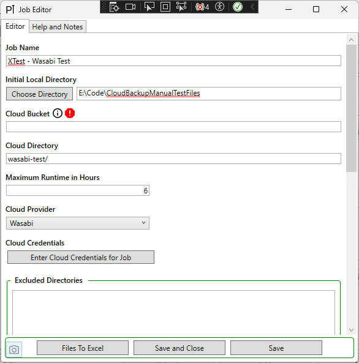
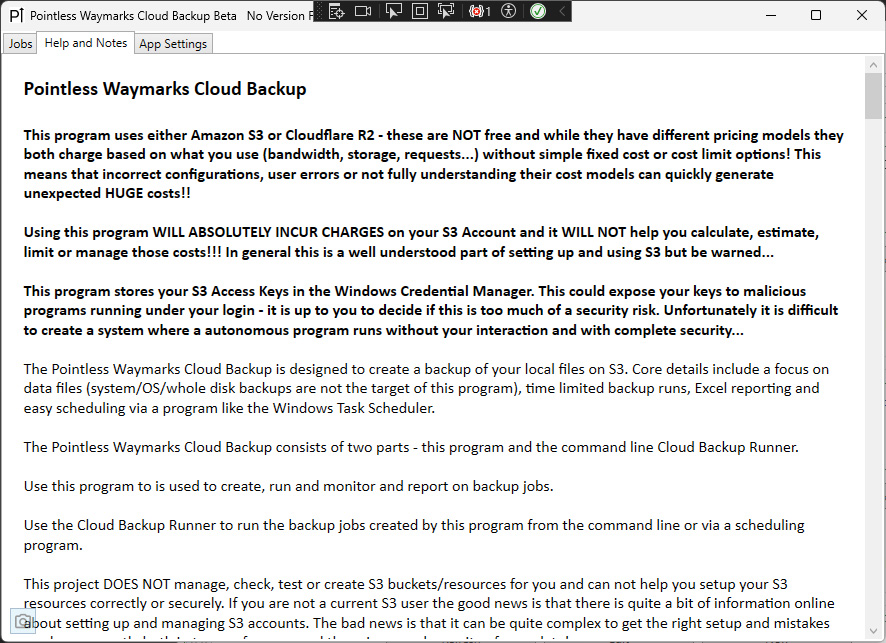
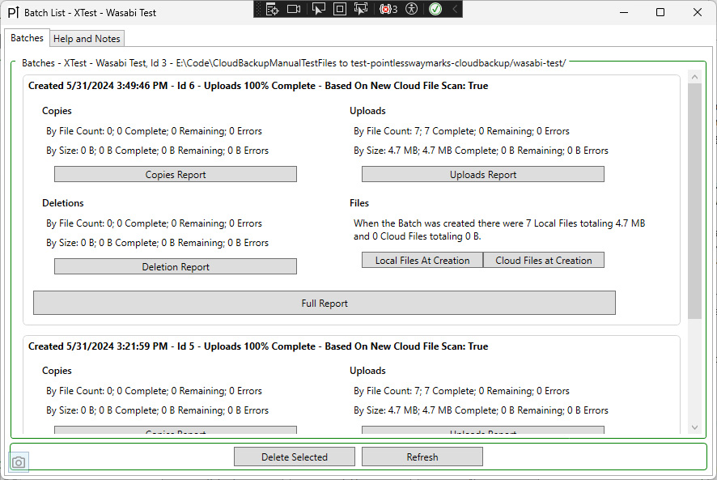

# Pointless Waymarks - Cloud Backup

The Pointless Waymarks Cloud Backup is part of the [Pointless Waymarks Project](https://github.com/cmiles/PointlessWaymarksProject).

*At this point there are no public installers/releases from the Pointless Waymarks Project - the code is MIT Licensed made public on GitHub to share with friends, colleagues and anyone who finds the code interesting or useful. This project is probably only suitable for use if you enjoy debugging and working on code!*

There is some obvious absurdity in writing your own backup program - so many backup and sync programs already exist that it feels pointless to even try to make a list of them... But regardless I didn't quite find what I was looking for and enjoy writing software so I wrote my own! Goals/Reasons/Features/Ideas:
- Backup to a Cloud Storage Service that is widely accessible - in an unhappy situation you should be able to access your backup with a wide variety of tools, platforms and programs.
- Backup to an Easily Browsable File System - the backup should be directly viewable and easily browsable without any special software.
- Data Focused - No special consideration to backing up (or restoring) entire systems/OSes/VMs...
- Minimal Reliance on a Database/Saved Backup Information - with large backups often taking days or weeks to complete you should be able to re-enter a reasonable amount of information about a backup and have it resume even if the backup database is deleted/lost/corrupt.
- No Sync Functionality - the process is only one way, no amount of (mis)configuration can result in local files being accidentally deleted because of a sync with the cloud.
- Max Runtime Limit - in many situations it is better not to try to run backup uploads while also doing all of today's online life things (video calls, remote work, streaming, ...) and that needs to be an option in the scheduling of the backup runs.

## Warnings

**This program uses S3 - S3 is never free and vendors like Amazon will charge you for nearly EVERYTHING related to S3 - bandwidth, storage, requests... Using this program WILL INCUR CHARGES on your S3 Account and it WILL NOT help you calculate, estimate, limit or manage those costs!! In general this is a well understood part of setting up and using S3 but be warned...**

**This program stores your AWS Keys in the [Windows Credential Manager](https://support.microsoft.com/en-us/windows/accessing-credential-manager-1b5c916a-6a16-889f-8581-fc16e8165ac0). This could expose your keys to malicious programs running under your login - it is up to you to decide if this is too much of a security risk.**

**This program creates a simple mirror of your local directories and files on S3 and to create this mirror it WILL DELETE FILES ON S3 without prompting you - you may be able to version-enable your S3 Bucket and mitigate this risk, but the program itself has no sense of a recycle bin, history or archiving...**

## General Information

For me this program is basically a companion to the [Pointless Waymarks CMS](https://github.com/cmiles/PointlessWaymarksProject). A large amount of the data I care about is in CMS sites that are synced to S3. But what the CMS is not designed to do is work with RAW photographs or large chunks of data that aren't imported/categorized/tagged - this program is my way of addressing that and getting the data I care that isn't in a Pointless Waymarks CMS site into S3 (Amazon AWS, Cloudflare R2, Wasabi).

The Pointless Waymarks Cloud Backup consists of a GUI (this project) to create, update, edit, monitor and report on Backup Jobs and a [command line program](https://github.com/cmiles/PointlessWaymarksProject/tree/main/PointlessWaymarks.CloudBackupRunner) to run the jobs thru a Task Scheduler.

Files are stored on S3 as a simple mirror of the local file system - there is no attempt to de-duplicate data, store incremental changes or otherwise complicate the storage - the backup is easily viewable in an S3 console or program.

Files are compared by an MD5 hash (stored as Metadata on S3) - the file comparison happens every run of the program. The database holds information about the backup runs including uploads, downloads, errors, etc... Because the backup is a simple mirror and a full comparison can be done on any run of the program a lost/deleted/corrupt database is only a minimal hassle in resuming a backup.

## Program Features

The Cloud Backup Job List:
 - Lists jobs and allows you to create new jobs, edit and delete existing jobs and see the last progress message from any local runs.
 - Run a report to see included/excluded files - the report is slow but it is very useful especially when setting up new jobs.
 - Launch a progress window to track the progress of a job running on the local machine - nice if you are running a commandline job thru a Task Scheduler and the console window is hidden.

Job Editor with some help seeing changes and getting valid data entered.

Transfer Batch List with Excel reporting.

Windows Notifications on Completion of a Job that you can click to see an Excel Report about the run.

Command Line Backup Runner with options to resume Batches and detailed progress.

*At this point there are no public installers/releases from the Pointless Waymarks Project - using this project is probably only appropriate if you enjoy debugging and working on code, but the code does include scripts to easily create published/installable versions on your local system.*