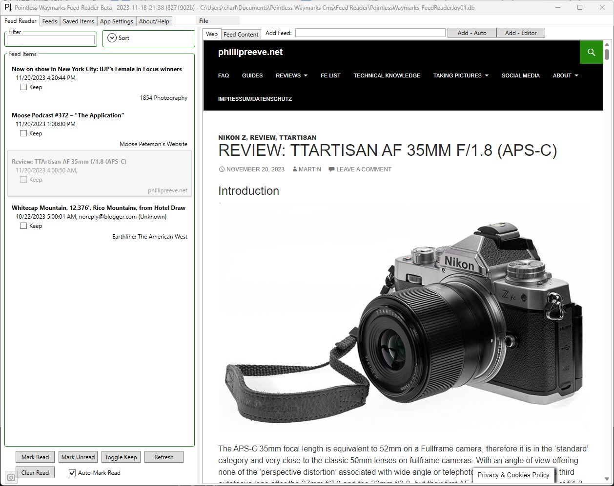

# Pointless Waymarks - Feed Reader

The Pointless Waymarks Feed Reader is part of the [Pointless Waymarks Project](https://github.com/cmiles/PointlessWaymarksProject).

*At this point there are no public installers/releases from the Pointless Waymarks Project - the code is MIT Licensed made public on GitHub to share with friends, colleagues and anyone who finds the code interesting or useful. This project is probably only suitable for use if you enjoy debugging and working on code!*

## Ideas

Why write a desktop Feed Reader?

  - Maybe not the most important detail but it would be false to say that nostalgia isn't part of it - while I can't truly remember the details I have fond memories of Nick Bradbury's FeedDemon! Of course it was a different time, I was a different person and the web was a different place - but regardless what good memories!
  - Maybe more importantly I've started to see the 'limitation' of local network only, desktop only, as just another design choice - there are things best left on a single computer, best done at home, ok limited to local access and just not needed on every device everywhere... Reading Feeds, catching up and following links is a great start of the day - but doing that at my desk in the AM, with some coffee, is enough... There are too many things to do out in the real world, too many things to build and create to get stuck doom scrolling the web!
  - I'm convinced that for me the best approach to Feeds is a simple list with minimal options! I've used various Readers for years and while I have gotten excited about various features over the years it seems like everything except the basics never get used long term.
  - Joy! It's fun to build new software!!

