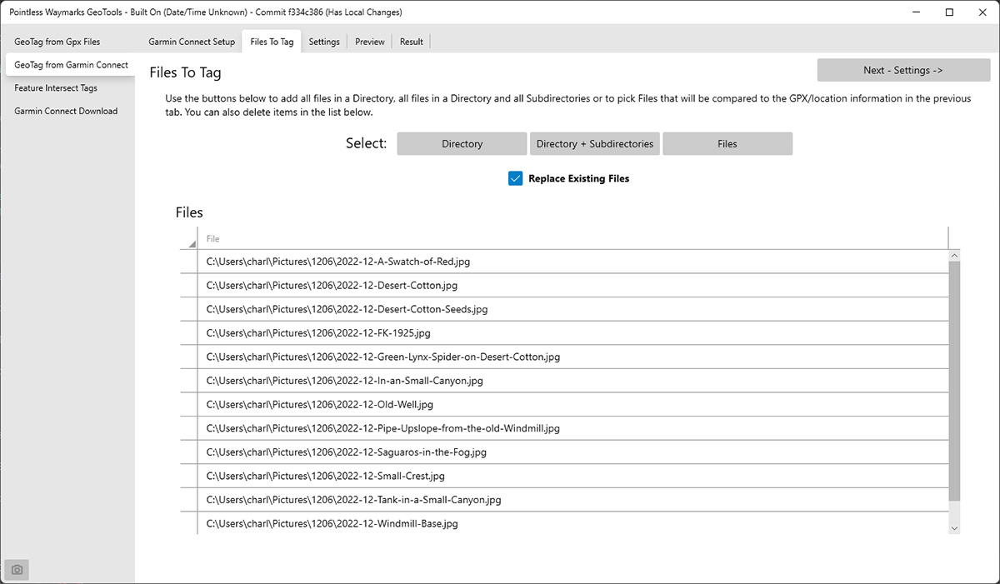
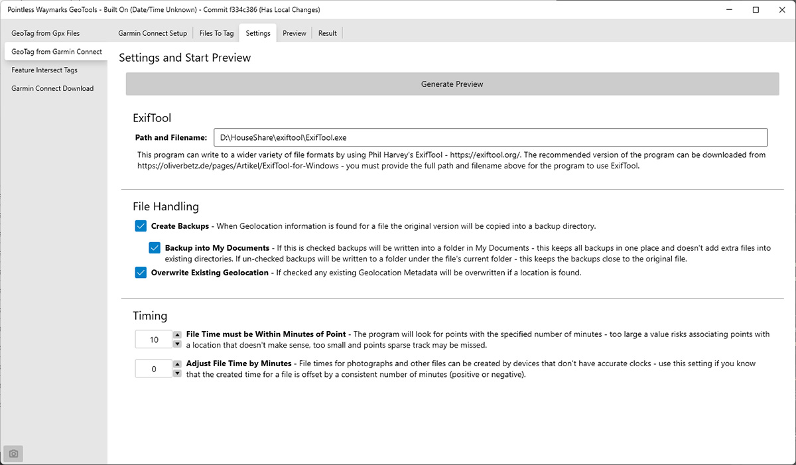
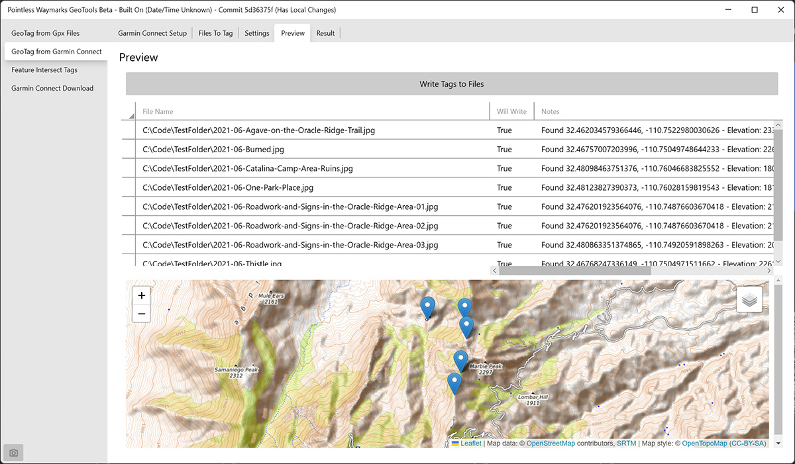
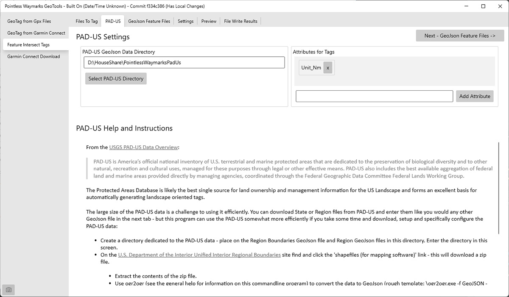
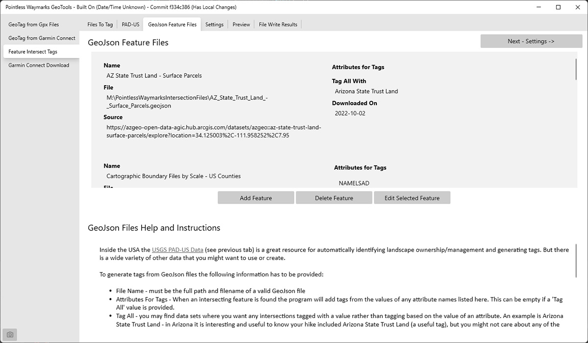
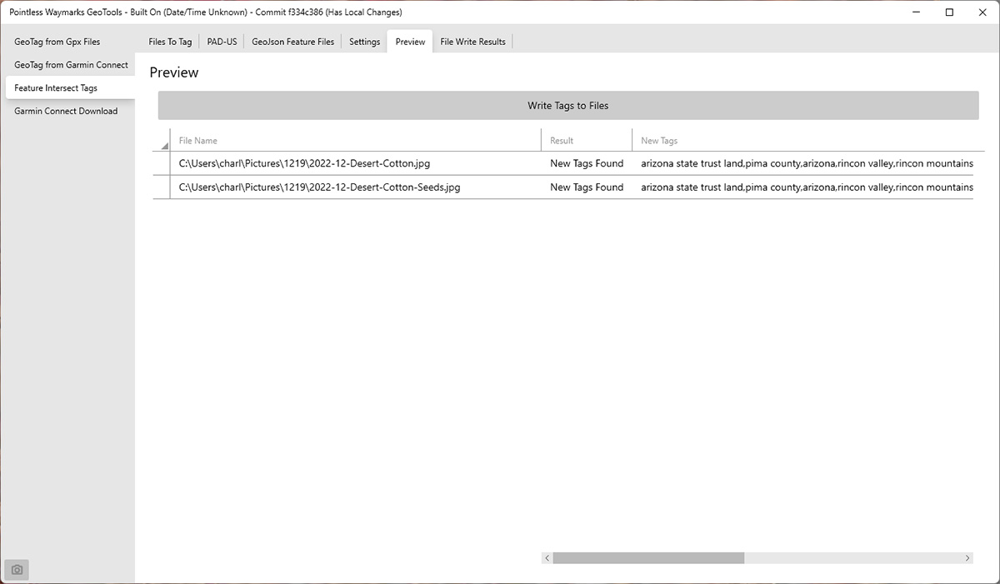
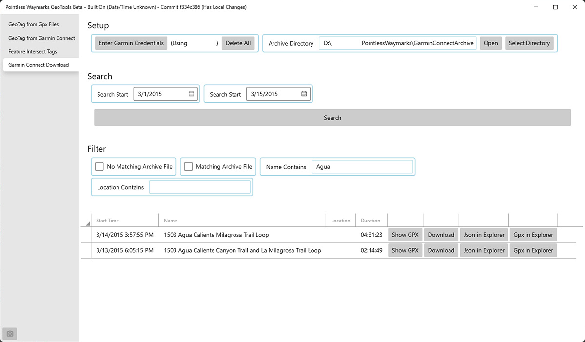

# Pointless Waymarks GeoTools

This program has several functions that are useful for GeoTagging photographs, automatically generating tags for GeoTagged photographs and working with Garmin Connect data.

## GeoTagging - GPX File Based

This allows you to select GPX Files, select files to Tag, get a preview and write the tags to a file. For this to work you need to include GPX files in your selection that cover the time the photograph was taken - and the program must be able to determine the time the photograph was taken.

## GeoTagging - Garmin Connect Based

Garmin Connect is an incredible free service that many devices and other services will sync to with minimal effort. The program will look for Garmin Activities that match the times of the files you want to GeoTag, download GPX files and, if possible, use that information to GeoTag your files. This can save you some effort downloading and picking the correct GPX Files/Activities to GeoTag your photos with.

### Why GeoTagging?

Several astute questions about the functionality above:
 - Why? Don't Lightroom, Exiftools, GeoSetter, your phone... already GeoTag? The direct tie in to Garmin Connect, learning/fun/interest and putting both the GeoTagging and Feature Intersect into one program were all motivations. Certainly there are already plenty of fantastic programs that GeoTag items.
 - Isn't GeoTagging and revealing locations a dubious goal for landscape photography? This is an incredibly important question - but it makes the assumption that you are going to release/publish/make public GeoTagged photographs... One reason to GeoTag your original photographs is to retain as much information as possible  about 'where' - it is easy, even with places you care about and photos you love for memories to fade over time - decades later what is obvious now is sometimes a complete mystery... Many Photo editors and digital asset management tools have easy to find and use functionality to remove location Metadata when exporting your photos. However - don't think that removing location metadata makes your location a secret - please share responsibly! 

## Feature Intersect Tags

With information published about the boundaries of parks, forests, monuments, etc. why not take advantage of that information to automatically tag you photos? Sometimes it is easy enough to create these tags by hand - but with complex boundaries, unfamiliar terrain and County/State/Federal land types all involved over time it has become clear to me that this is work better done by the computer...

This program can compare the location of a photograph with PAD-US data and reference GeoJson files to pull tags from the intersections.

You will have to download and setup data for this program to use - this takes some work, time and attention to detail but it also means that once you have the data setup it is available fully offline! The program contains help and instructions for getting and setting up the data. Brief notes about the three basic data sourcesthat can be used are below - see the help in the program or the [README](../PointlessWaymarks.FeatureIntersectionTags/README.md) for the FeatureIntersectionTags library for more information.

### PAD-US

The PAD-US may be all you need inside the USA to get a good selection of tags about the type and ownership of the land you are on. From the [USGS PAD-US Data Overview](https://www.usgs.gov/programs/gap-analysis-project/science/pad-us-data-overview):

> PAD-US is America’s official national inventory of U.S. terrestrial and marine protected areas that are dedicated to the preservation of biological diversity and to other natural, recreation and cultural uses, managed for these purposes through legal or other effective means. PAD-US also includes the best available aggregation of federal land and marine areas provided directly by managing agencies, coordinated through the Federal Geographic Data Committee Federal Lands Working Group.

### GeoJson Reference Files

GeoJson files are available for a large number of boundaries - from administrative to scientific and more! Some examples:
- [USDA Forest Service FSGeodata Clearinghouse - FSGeodata Clearinghouse](https://data.fs.usda.gov/geodata/)
- [National Park Service](https://public-nps.opendata.arcgis.com/)
- State Land Departments - In some western states State Land, or State Trust Land, is an important land ownership category - for Arizona: [AZGeo Data](https://azgeo-open-data-agic.hub.arcgis.com/)
- [GIS and GPS Downloadable Data - Wilderness Connect](https://wilderness.net/visit-wilderness/gis-gps.php)
- [Census Mapping Files](https://www.census.gov/geographies/mapping-files.html) - great for US state and county data
- [BLM GBP Hub](https://gbp-blm-egis.hub.arcgis.com/)

### Your Own GeoJson Files!

It is likely that there are local names, landmarks of personal significance and regions of specific interest that you might want tags for but that don't - and will not ever - appear in any published data... In some cases one simple solution is to just create your own reference GeoJson files for the program to use! You will need to make sure to create data that the program to read - but [geojson.io](https://geojson.io/) is a pretty easy way to get started...

## Garmin Connect Download

Many thanks to Garmin Connect - I have been using this service for over a decade! The Garmin Connect Download makes it easy to download an Activity and GPX file from your account to an Archive Directory on the local system. In addition the interface has some limited search and filter capabilities to make finding what you want easier.

