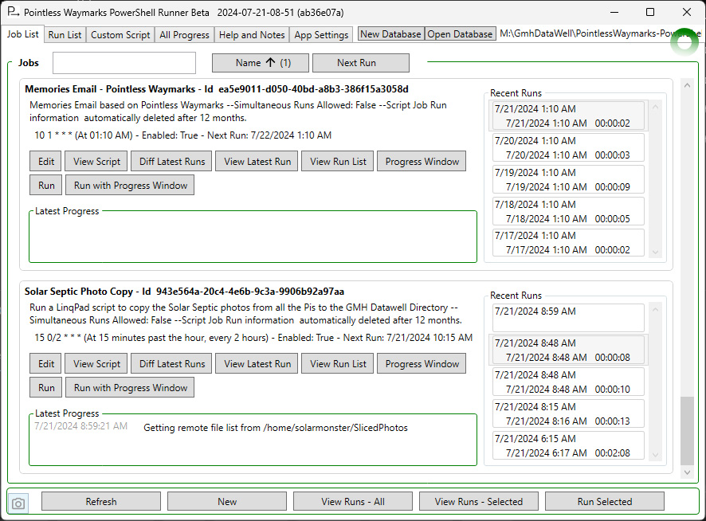
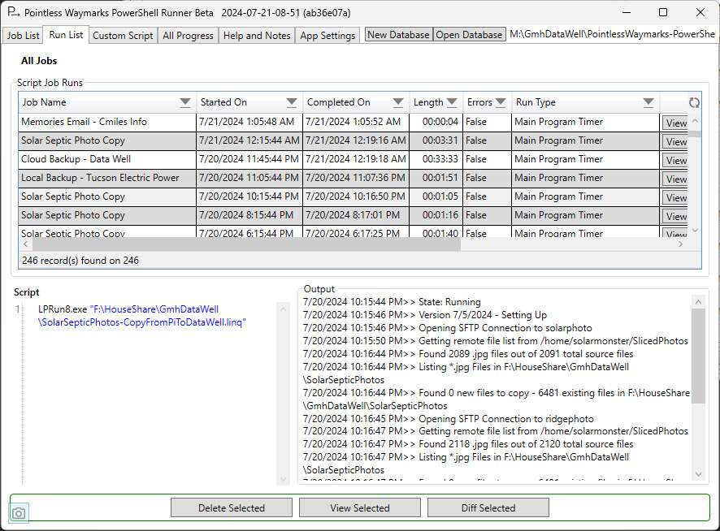
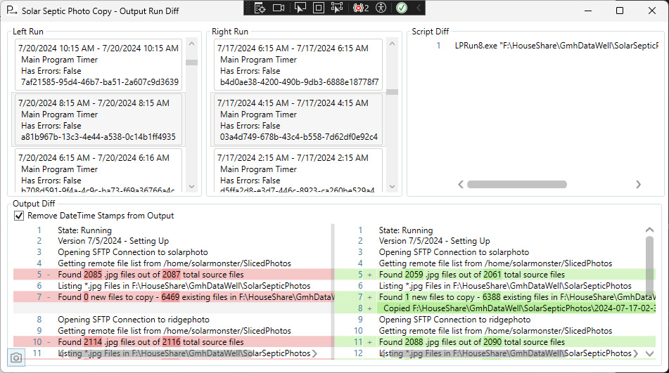

## PowerShell Runner

The program provides a way to store simple powershell scripts and run them on a schedule, or on demand. Features include:
 - Realtime progress from all running Jobs
 - A history of Job Runs that includes the output from the script
 - SQLite data storage with Scripts and Output encrypted

For many years I used the Windows Task Scheduler to run sceduled jobs - both at home and at work - and have to say, especially combined with [David Hall's .NET wrapper for the Windows Task Scheduler](https://github.com/dahall/TaskScheduler) to address some pain points, it is a great tool and I think it can often be a brilliant 'least cost simplest solution'.

But last year I had some problems with the Windows Task Scheduler on a personal machine that involved user accounts and details that I have zero interest in troubleshooting... I eventually fixed the problem but it made me realize that while Windows Task Scheduler is a logical, robust, imminently practical choice it isn't fun/happy/joyous to work with and it is overkill for a lot of what I want to do...

So while Windows Task Scheduler is perfectly servicable - and there are additional/enhanced options like [Advanced Task Scheduler](https://www.advscheduler.com/) - I decided to write my own program to run scheduled tasks!

It may be valuable to know what this program doesn't do:
 - There are no options for running 'missed' schedules, maximum run time, running only with network connections present, ... - there are many schedule related options found in Windows Task Scheduler that are not relevant to the goals of this program.
 - This runs scripts in a new/vanilla Powershell Runspace - scripts with external dependencies may not work or may need to be modified.
 - There is no option to run as another account/with elevated permissions - you might be able to script what you need in powershell but this is fundamentally just a 'program that runs on your desktop'!

 
 
 