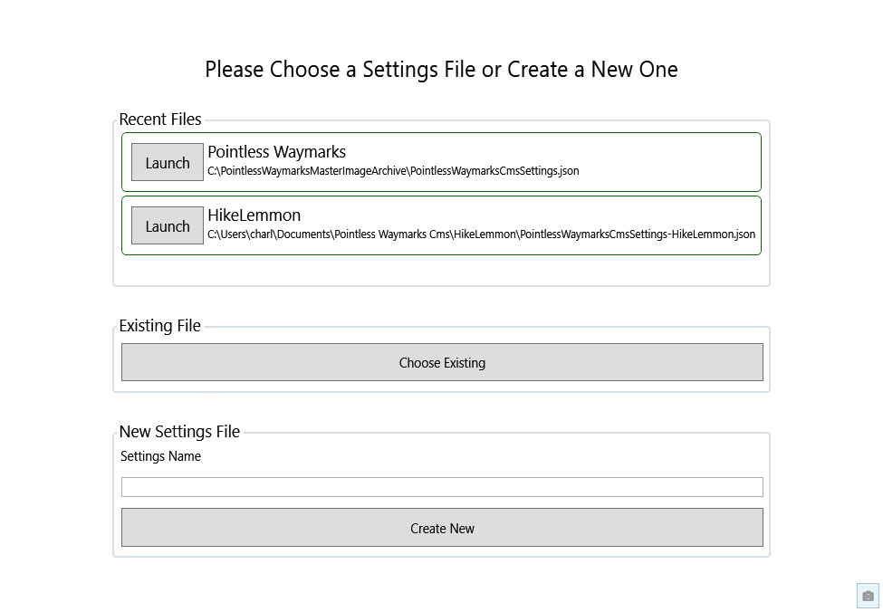
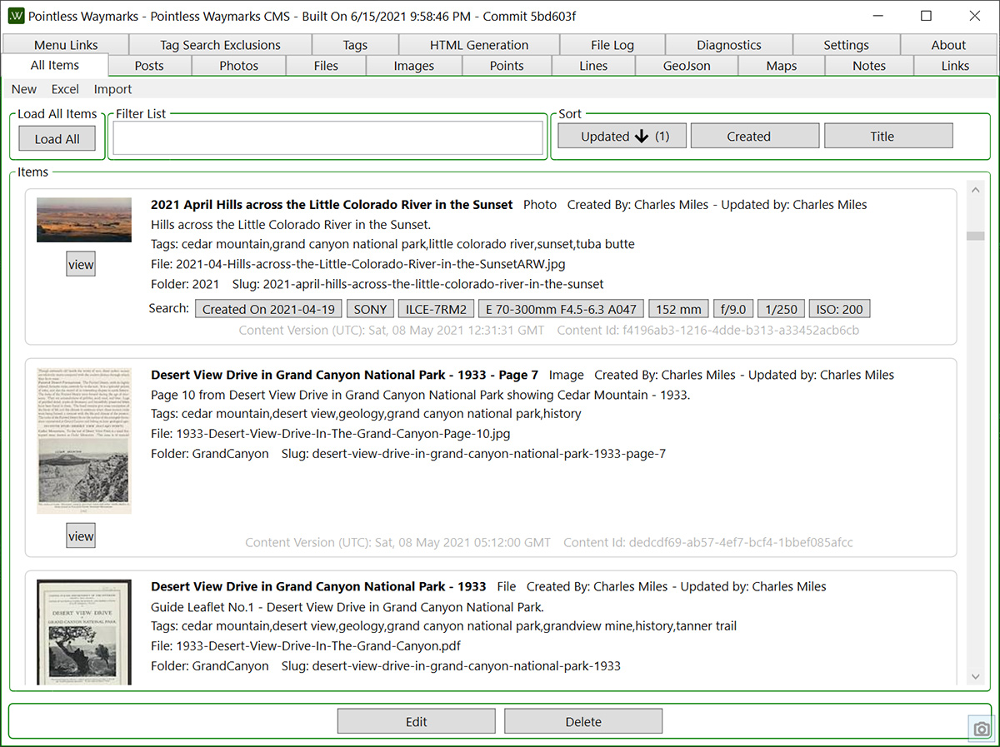
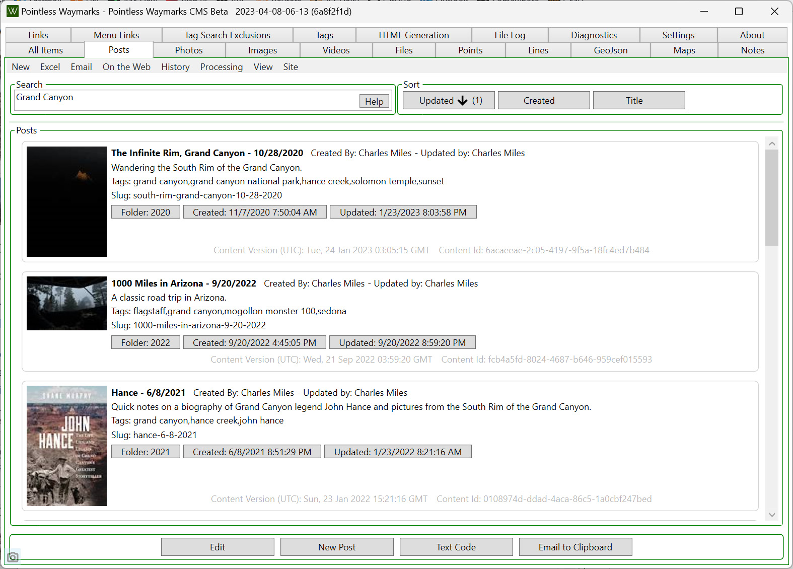
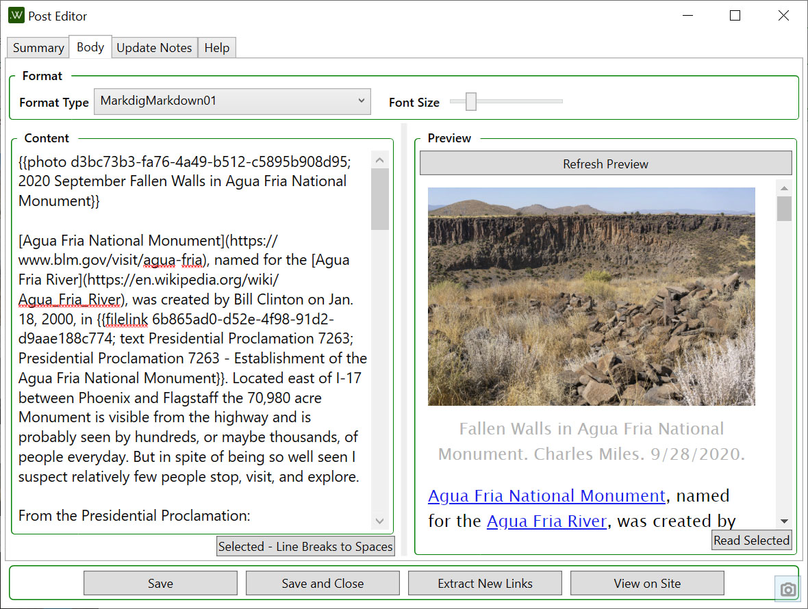
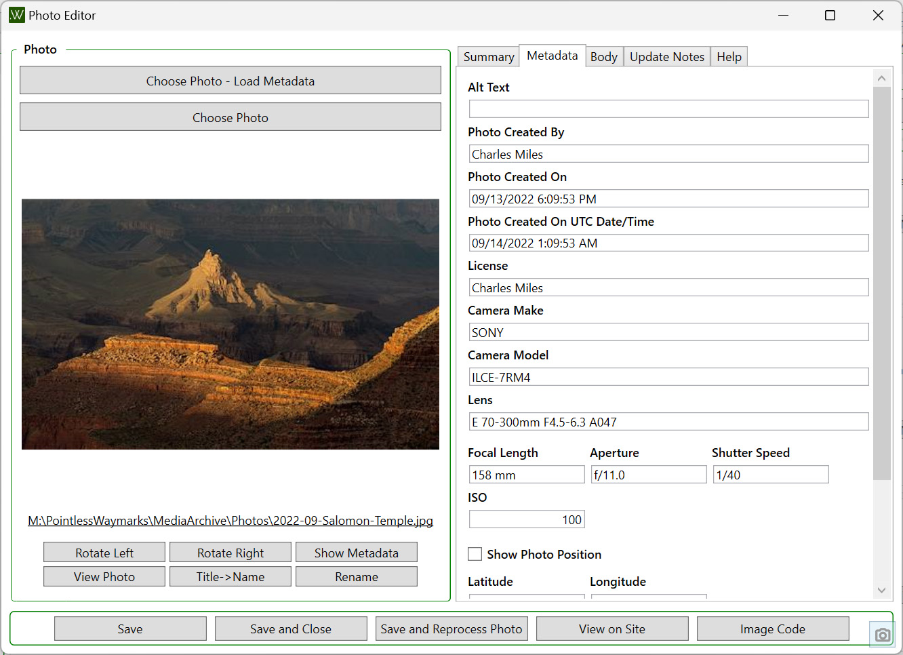
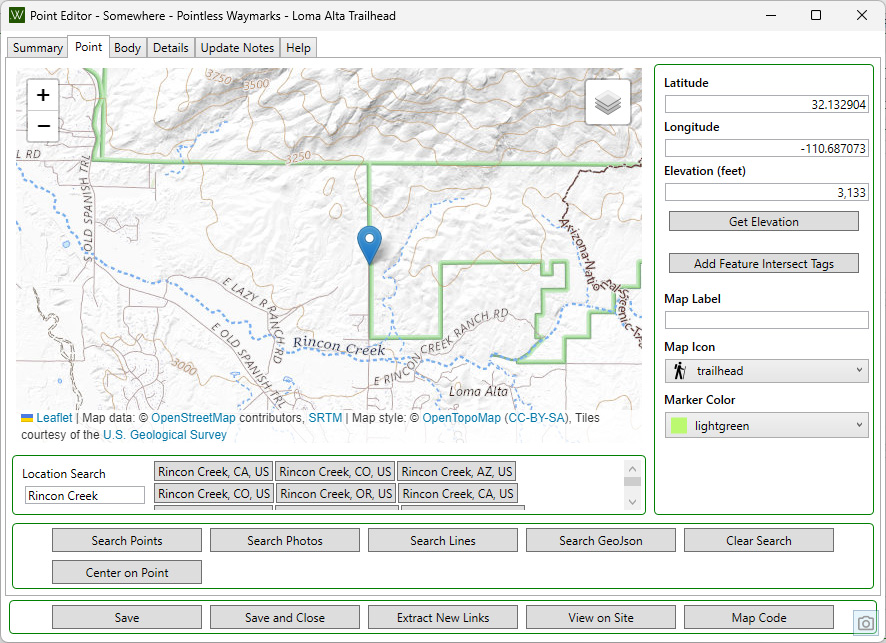
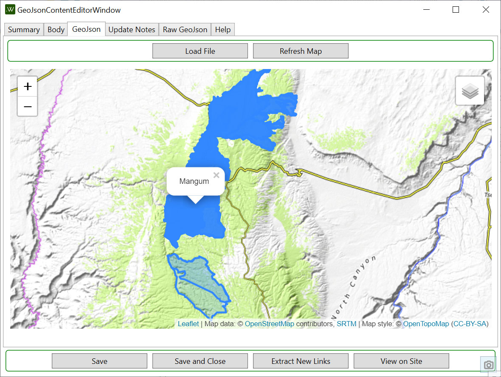
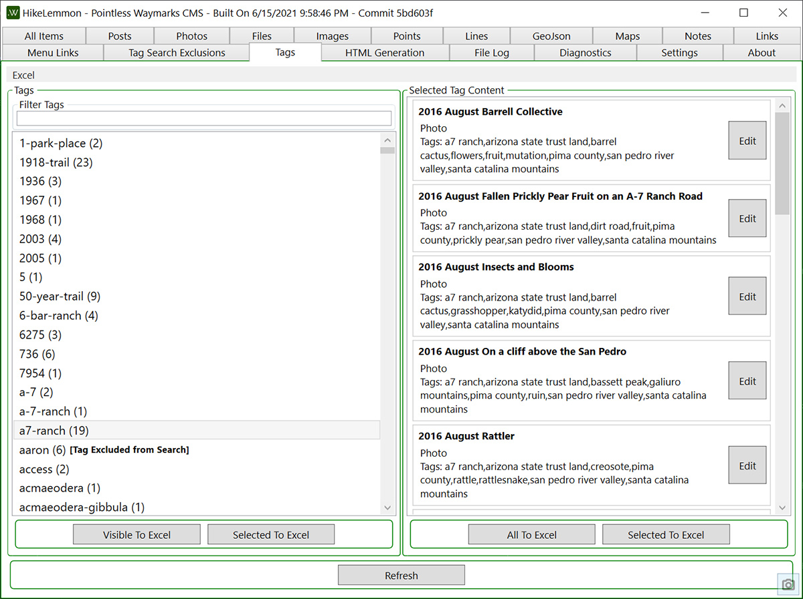
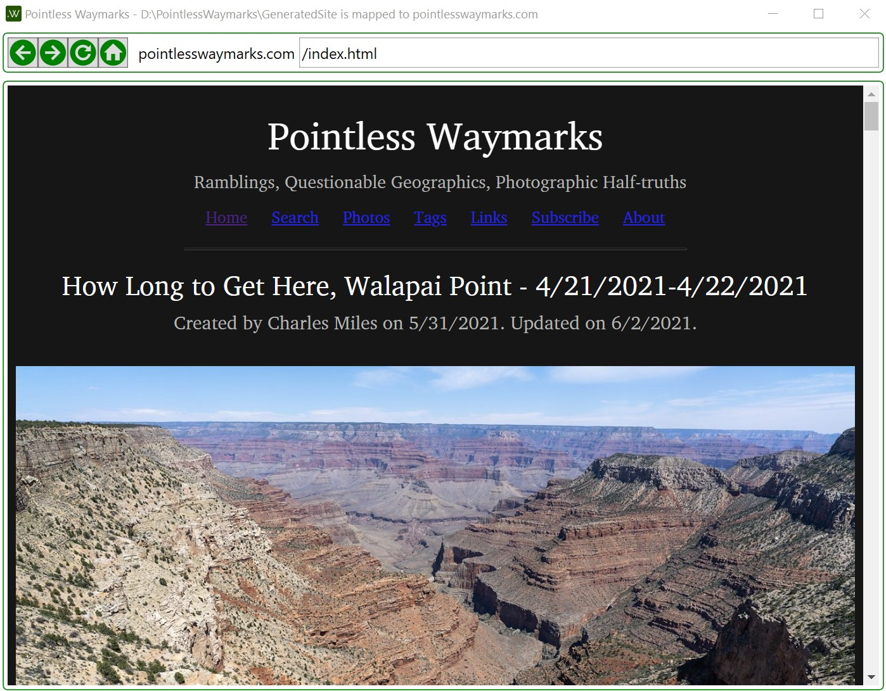

### Contact and Donate to your Favorite Open Source Projects!

Working on a zero-budget-no-commercial-goals personal project like this one and having so many great libraries to build with is an incredible privilege (there is a list of projects I am using at the bottom of this page) - one of my goals for 2021 is to do a better job reaching out to, thanking and making donations when possible/appropriate to the projects that have been useful to me. Please consider doing the same!!!

# Pointless Waymarks CMS

At this point this project is not intended for general use - it is made public under the MIT License to share with friends, colleagues and anyone who finds the code interesting or useful.

Pointless Waymarks CMS is a .NET Core 6 Windows WPF GUI for generating a static website based on database information and a settings file. It is not an 'all purpose static site generation solution' - the focus is creating durable, rich, low maintenance, free, long-lasting content about the landscape, place, photography, nature, history, life...

[Pointless Waymarks](https://PointlessWaymarks.com) is generated with the Pointless Waymarks CMS and is a good example of both the output and intent.

Some details:
 - A static site so it can be low cost, low maintenance and highly durable
 - An integrated Local Viewer because not all content needs to be online
 - Database driven to offer flexibility in creating and updating content and to potentially support the generation of multiple output formats
 - Custom software to optimize support for a limited set of content types
 - Desktop creation software because it is an excellent way to create zero cost software. WPF because I largely work in Windows, it is my favorite Windows GUI technology atm and because the experimentation/learning/coding I do here flows back into my day job where I help to create and maintain an Inventory Management and Reporting system that has a WPF Front End.
 - A focus on the content and a simple functional presentation. My experience is that websites that focus on a simple presentations of content can survive, have impact and be meaningful for many many years without heavy revisions into the 'latest' style or newest framework.

Todo Lists, Idea Lists and a Development Log are [found in a DevNotes.md file that is versioned along with the code](PointlessWaymarksCmsContentEditor/DevNotes.md).

If you have questions or comments please contact me at PointlessWaymarks@gmail.com - as noted above there is currently no intent to create 'public releases' and using this software is probably only reasonable if you don't mind (enjoy!) a little debugging and bug fixing...

## Application Screen Shots

### Launch Screen

Options to launch recent projects or create a new project.

### Content Lists

The first tab in the application is an 'All Content' list. Like all of the lists you can sort and filter the list, import/export from excel and the list will update automatically in the background as content changes. In the All Content list menus, buttons and context menu allow you to take a limited set of actions that apply to all content types. It is possible to do quite a bit of work without ever needing to switch back-and-forth between the tabs for specific content types - especially when everything you are working on is recent.

Each Content Type has a dedicated list interface - these lists have more content type specific functions that are not found in the All Content List. Content lists start by loading a limited number of recent entries and present an option to load all entries - this compromise allows the lists to load quickly showing the content you are most likely to want to see.

The ability to export to Excel, edit and import the changes is provided for all content types and most fields. Many updates are more easily made in the program but Excel provides a powerful interface for complicated/bulk edits.

Photographs are a central content type in this program and there is decent support for importing multiple photos at once filling the various fields by extracting metadata from the photo. I have found it rather painless to import even larger batches of photographs with minimal clean up afterwards.

The Photo List items have buttons to quickly find other similar photos based on details such as Camera Make, Lens, Aperture, Shutter Speed, etc. Not shown but available in the Photo List under the Reports menu are reports on photos with potential problems such as 'No Tags' or 'Blank License' and an option to export all of a photo's 'raw' metadata to an html file.

### Content Editors

The content editors are intended to be simple, helpful and functional. Change and validation indicators, previews and help with common editing actions are provided. Spatial types - Points, Lines and GeoJson have [Leaflet](https://leafletjs.com/) based previews.

### Tags

Tags are a primary way of connecting and organizing content - a Tag Editor along with Excel Export/Import provide support for organizing/correcting/updating tags.

This software has no support for storing 'completely private' content - but it does have support for excluding Tags from the site's various search pages and indicating to search engines not to index excluded Tag Pages. This can be a good way of providing some 'modesty' for tags that you might not want to delete - but that you also don't want to be prominent.

### Menu Links

Content is the focus of the project and admin/widget/header/menu options are kept as minimal as possible - but some options are needed such as a very simple menu editor. 

### File Change Tracking

Deploying the site is simply a matter of syncing the content from the generated local site to its destination. To help with that process the program tracks written files and has options to export a list of files, create very basic S3 cli scripts or use the simple built in S3 uploader. There is also support to detect changed and no longer needed files on S3.

### Local Site Preview

A viewer for the on-disk version of the site is available both in the editor and as a stand alone program. Making use of Microsoft's Webview2 this makes it possible to browse your local site in an intuitive way and provides good access to the browsers dev tools.

### Password Protected Sites via Cloudflare Workers

Not currently incorporated into the program in any way, but included in this repo, is a simple Cloudflare Worker script for Basic Auth (Use with caution! This is only lightly tested...). This provides a very simple zero cost (Cloudflare Workers are available on their free plan) way to password protect a site. There is no sense of 'user accounts' or options to change/recover passwords so this is only relevant in limited scenarios, but I have found this to be a nice way to put content online for myself, friends and family without making it public.

## Software Used By and In Building Pointless Waymarks CMS

I am incredibly grateful to the all the people who have created the software that makes it possible to rapidly build useful, open, low/no-cost software. Below is a mostly-up-to-date-and-largely-comprehensive list of tools/packages/libraries/... that I am using for this project:

Tools:
 - [Visual Studio IDE](https://visualstudio.microsoft.com/), [.NET Core (Linux, macOS, and Windows)](https://dotnet.microsoft.com/download/dotnet-core)
 - [ReSharper: The Visual Studio Extension for .NET Developers by JetBrains](https://www.jetbrains.com/resharper/)
   - [JetBrains/ForTea](https://github.com/jetbrains/fortea/) - ReSharper support for T4 Templates.
 - [LINQPad - The .NET Programmer's Playground](https://www.linqpad.net/)
 - [DB Browser for SQLite](https://sqlitebrowser.org/)
 - [RegexBuddy: Learn, Create, Understand, Test, Use and Save Regular Expression](https://www.regexbuddy.com/)
 - [Markdown Monster - A better Markdown Editor for Windows](https://markdownmonster.west-wind.com/)
 - [Material Design Icons](http://materialdesignicons.com/)

Packages/Libraries/Services:
 - [dotnet/core: Home repository for .NET Core](https://github.com/dotnet/core), [dotnet/efcore: EF Core is a modern object-database mapper for .NET. It supports LINQ queries, change tracking, updates, and schema migrations.](https://github.com/dotnet/efcore) and various other Microsoft Technologies
 - [SQLite](https://www.sqlite.org/index.html) - An absolutely brilliant project - having a Public Domain option for such a high quality data store that can be used locally and cross platform is amazing! Public Domain.
 - [saucecontrol/PhotoSauce: MagicScaler high-performance, high-quality image processing pipeline for .NET](https://github.com/saucecontrol/PhotoSauce) - Fast high quality Image Resizing. If you personally care about image quality image resizing becomes a complicated topic very quickly and I think the results from this library are excellent. Ms-Pl.
 - [drewnoakes/metadata-extractor-dotnet: Extracts Exif, IPTC, XMP, ICC and other metadata from image, video and audio files](https://github.com/drewnoakes/metadata-extractor-dotnet) - Used to read the metadata in Photographs - there are a number of ways to get this data but it is amazing to have a single go to library to work with that already handles a number of the (many, many, many...) issues. Apache License, Version 2.0.
 - [ClosedXML](https://github.com/ClosedXML/ClosedXML) - A great way to read and write Excel Files - I have years of experience with this library and it is both excellent and well maintained. MIT License.
 - [TinyIpc](https://github.com/steamcore/TinyIpc) - Windows Desktop Inter-process Communication wrapped up into a super simple to use interface for C#. After trying a number of things over the years I think this technology wrapped into a great C# library is absolutely a key piece of .NET Windows desktop development that provides a reasonable way for your apps to communicate with each other 'locally'. MIT License.
 - [WindowsCommunityToolkit](https://github.com/CommunityToolkit/WindowsCommunityToolkit) - [Microsoft.Toolkit.Mvvm 7.1.2](https://www.nuget.org/packages/Microsoft.Toolkit.Mvvm/) - The Mvvm Toolkit provides a number of good tools including SourceGenerators that can implement IPropertyNotificationChanged! MIT License.
 - [AngleSharp - Home](https://anglesharp.github.io/) - [AngleSharp/AngleSharp: The ultimate angle brackets parser library parsing HTML5, MathML, SVG and CSS to construct a DOM based on the official W3C specifications.](https://github.com/AngleSharp/AngleSharp) - Mainly used for parsing web pages when creating links. MIT License.
 - [fluentmigrator/fluentmigrator: Fluent migrations framework for .NET](https://github.com/fluentmigrator/fluentmigrator) -  documentation](https://fluentmigrator.github.io/)
 - [HtmlTags/htmltags: Simple object model for generating HTML](https://github.com/HtmlTags/htmltags) - Currently this project uses a combination of T4 templates and tags built by this library to produce HTML. Apache License, Version 2.0.
 - [anakic/Jot: Jot is a library for persisting and applying .NET application state.](https://github.com/anakic/Jot) - Used to save application state most prominently main window position.
 - [lunet-io/markdig: A fast, powerful, CommonMark compliant, extensible Markdown processor for .NET](https://github.com/lunet-io/markdig) and [Kryptos-FR/markdig.wpf: A WPF library for lunet-io/markdig https://github.com/lunet-io/markdig](https://github.com/Kryptos-FR/markdig.wpf) - Used to process Commonmark Markdown both inside the application and for HTML generation. BSD 2-Clause Simplified License and MIT License.
 - [thomasgalliker/ObjectDumper: ObjectDumper is a utility which aims to serialize C# objects to string for debugging and logging purposes.](https://github.com/thomasgalliker/ObjectDumper) - A quick way to convert objects to human readable strings/formats. Apache License, Version 2.0
 - [acemod13/ookii-dialogs-wpf: Common dialog classes for WPF applications](https://github.com/acemod13/ookii-dialogs-wpf) - easy access to several nice dialogs. [License of Ookii.Dialogs.Wpf.NETCore 2.1.0](https://www.nuget.org/packages/Ookii.Dialogs.Wpf.NETCore/2.1.0/License).
 - [omuleanu/ValueInjecter: convention based mapper](https://github.com/omuleanu/ValueInjecter) - Quick mapping between objects without any setup needed. MIT License.
 - [micdenny/WpfScreenHelper: Porting of Windows Forms Screen helper for Windows Presentation Foundation (WPF). It avoids dependencies on Windows Forms libraries when developing in WPF.](https://github.com/micdenny/WpfScreenHelper) - help with some details of keeping windows in visible screen space without referencing WinForms. MIT License.
 - [kzu/GitInfo: Git and SemVer Info from MSBuild, C# and VB](https://github.com/kzu/GitInfo) - Git version information. MIT License.
 - [shrayasr/pinboard.net](https://github.com/shrayasr/pinboard.net/blob/master/LICENSE) - Easy to use wrapper for [Pinboard - 'Social Bookmarking for Introverts'](http://pinboard.in/). MIT License.
 - [shps951023/HtmlTableHelper: Mini C# IEnumerable object to HTML Table String Library](https://github.com/shps951023/HtmlTableHelper) - used for quick reporting output like the Photo Metadata Dump. MIT License.
 - [Pure](https://purecss.io/) - Used in the reporting output for simple styling. BSD and MIT Licenses.
 - [NetTopologySuite/NetTopologySuite: A .NET GIS solution](https://github.com/NetTopologySuite/NetTopologySuite). [NetTopologySuite License](https://github.com/NetTopologySuite/NetTopologySuite/blob/develop/License.md) - Nuget Package listed as BSD-3-Clause.
 - [NetTopologySuite/NetTopologySuite.IO.GPX: GPX I/O for NetTopologySuite](https://github.com/NetTopologySuite/NetTopologySuite.IO.GPX). BSD-3-Clause License.
 - [NetTopologySuite/NetTopologySuite.IO.GeoJSON: GeoJSON IO module for NTS.](https://github.com/NetTopologySuite/NetTopologySuite.IO.GeoJSON). BSD-3-Clause License.
 - [CompareNETObjects](https://github.com/GregFinzer/Compare-Net-Objects) - Comparison of object properties that stays quick/easy to use but has more options than you would be likely to create with custom reflection code and potentially more durability than hand coded comparisons. Ms-PL License.
 - [SimpleScreenShotCapture](https://github.com/cyotek/SimpleScreenshotCapture) and [Capturing screenshots using C# and p/invoke](https://www.cyotek.com/blog/capturing-screenshots-using-csharp-and-p-invoke)- An example project and blog post with information on and code for capturing screen and window shots using native methods. Used this as the basis for a WPF/[WpfScreenHelper](https://github.com/micdenny/WpfScreenHelper) version - the advantage over traditional WPF based window image methods is that XamlIsland type controls can be captured. Creative Commons Attribution 4.0 International License.
 - [Open Topo Data](https://www.opentopodata.org/) - Provides an open and free Elevation API and offers both a public service and the code to host the service yourself (including scripts/information to get the needed source data) - [GitHub: ajnisbet/opentopodata: Open alternative to the Google Elevation API!](https://github.com/ajnisbet/opentopodata). (Code) MIT License.
 - [Leaflet - a JavaScript library for interactive maps](https://leafletjs.com/) - [On GitHub](https://github.com/Leaflet/Leaflet). BSD-2-Clause License.
 - [elmarquis/Leaflet.GestureHandling: Brings the basic functionality of Google Maps Gesture Handling into Leaflet. Prevents users from getting trapped on the map when scrolling a long page.](https://github.com/elmarquis/Leaflet.GestureHandling). MIT License.
 - [aws/aws-sdk-net: The official AWS SDK for .NET](https://github.com/aws/aws-sdk-net/) - For Amazon S3 file management. Apache License 2.0.
 - [punker76/gong-wpf-dragdrop: The GongSolutions.WPF.DragDrop library is a drag'n'drop framework for WPF](https://github.com/punker76/gong-wpf-dragdrop). BSD-3-Clause License.
 - [bcwood/PressSharper: A C# class library for parsing WordPress XML export data.](https://github.com/bcwood/PressSharper) - the code from PressSharper was pulled into this project, updated for .net5.0, and lightly refactored and reformatted. PressSharper was forked from forked from [dreadwail/press_sharp: A C# class library for parsing Wordpress XML export data.](https://github.com/dreadwail/press_sharp). MIT License.
 - [jamesmontemagno/mvvm-helpers: Collection of MVVM helper classes for any application](https://github.com/jamesmontemagno/mvvm-helpers) - Code for Commands from this project was brought into this project. MIT License.
 - [commandlineparser/commandline: The best C# command line parser that brings standardized \*nix getopt style, for .NET. Includes F# support](https://github.com/commandlineparser/commandline) - MIT License.
 - [App-vNext/Polly: Polly is a .NET resilience and transient-fault-handling library that allows developers to express policies such as Retry, Circuit Breaker, Timeout, Bulkhead Isolation, and Fallback in a fluent and thread-safe manner. From version 6.0.1, Polly targets .NET Standard 1.1 and 2.0+.](https://github.com/App-vNext/Polly) - Great library for handling retry logic in .NET. New BSD License.
 - [replaysMike/TypeSupport: A CSharp library that makes it easier to work with Types dynamically.](https://github.com/replaysMike/TypeSupport) - When working with generic and dynamic types I appreciate some of the extension methods provided by this library to handle details like .IsNumericType that often seem to descend into endless edge cases when you try to write it yourself. GPL-3.0 License.
 - [Automate multiple Excel instances - CodeProject](https://www.codeproject.com/Articles/1157395/Automate-multiple-Excel-instances) - James Faix's excellent code for getting references to running Excel instances was pulled into this project, converted for style and upgraded to .NET 5. The basic approach in this article comes from a 2005 post by Andrew Whitechapel titled 'Getting the Application Object in a Shimmed Automation Add-in' - http://blogs.officezealot.com/whitechapel/archive/2005/04/10/4514.aspx. The post by Andrew Whitechapel is now only available thru the Wayback Machine - [Andrew Whitechapel : Getting the Application Object in a Shimmed Automation Add-in](https://web.archive.org/web/20130518152056/http://blogs.officezealot.com/whitechapel/archive/2005/04/10/4514.aspx)
 - [serilog/serilog: Simple .NET logging with fully-structured events](https://github.com/serilog/serilog). Easy full featured logging. Apache-2.0 License.
   - [RehanSaeed/Serilog.Exceptions: Log exception details and custom properties that are not output in Exception.ToString().](https://github.com/RehanSaeed/Serilog.Exceptions) MIT License.
   - [serilog/serilog-formatting-compact: Compact JSON event format for Serilog](https://github.com/serilog/serilog-formatting-compact). Apache-2.0 License.
   - [serilog/serilog-sinks-console: Write log events to System.Console as text or JSON, with ANSI theme support](https://github.com/serilog/serilog-sinks-console). Apache-2.0 License.
