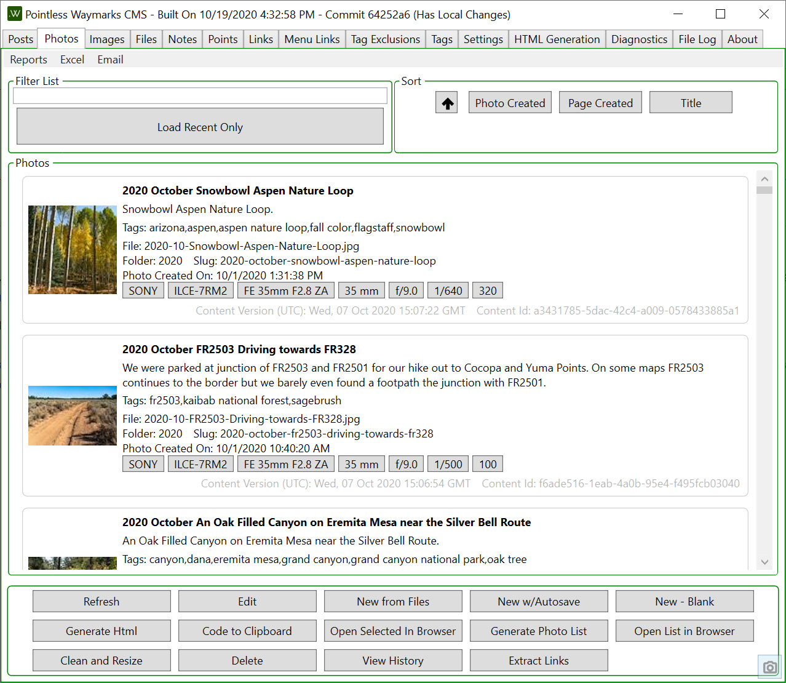
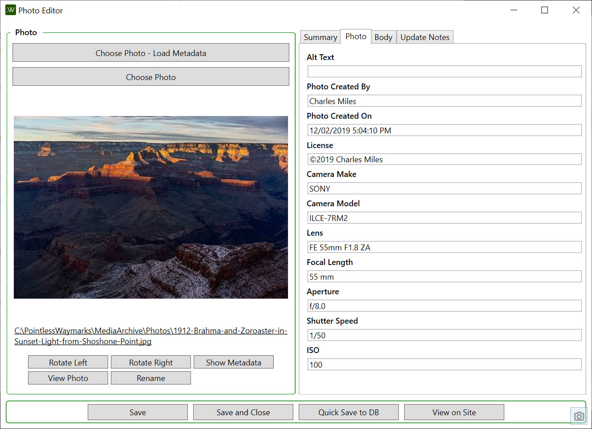
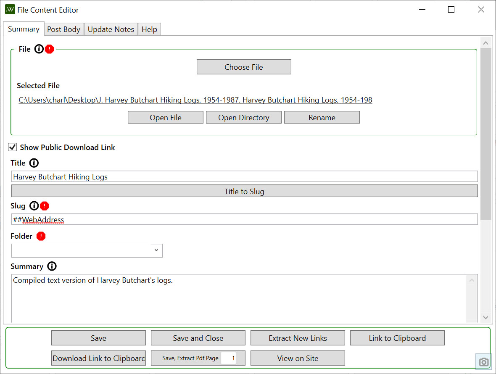
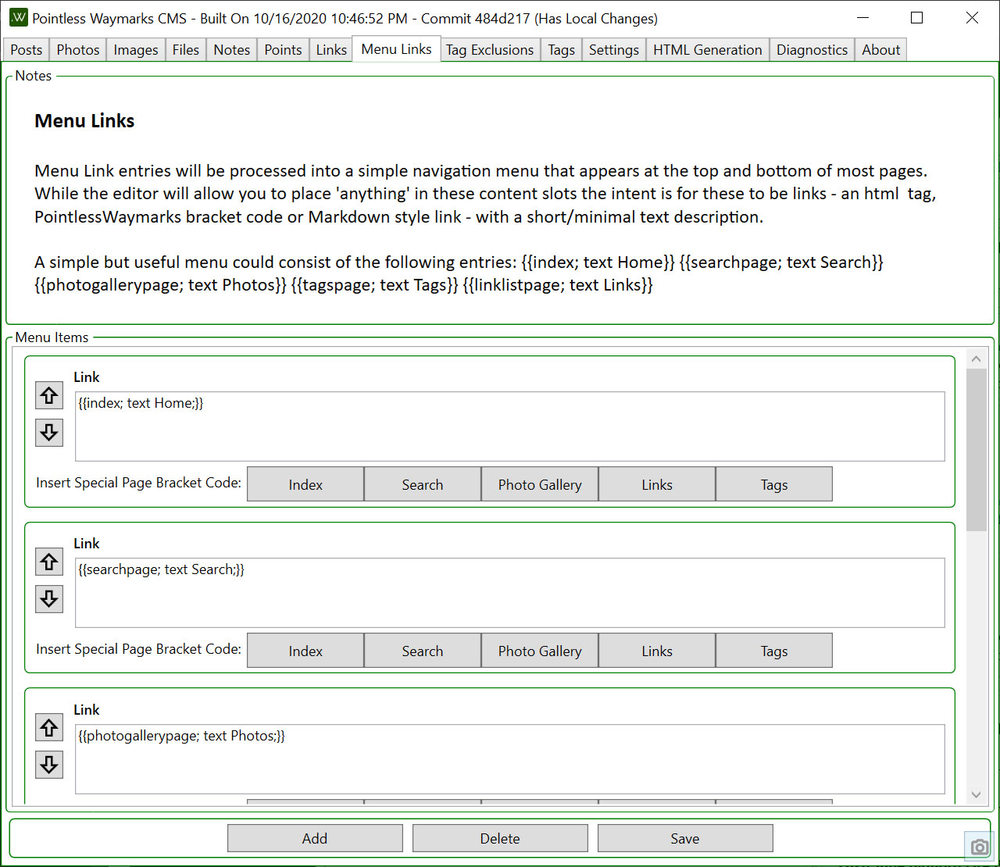

# Pointless Waymarks CMS

This project is not currently intended for 'general public' use - it is made public under an MIT license both to share with friends and just-in-case any of the code is useful to anyone.

This project is a .NET Core Windows WPF GUI for generating a static website based on database information and a settings file. This software is currently being used to create https://PointlessWaymarks.com. It is not intended as 'general purpose static site generation software' and only supports the creation and generation of a limited set of content types with a limited set of options.

Because this is a personal project without commercial goals it may be useful to understand that the focus of this project is to help create long-lasting beautiful free authentic content out of a love for the subject matter. The inspiration is the incredible richness and joy that creating content about the landscape has added to my life and the focus for the project is informed by my realization that having front page search results for personal content hasn't added to my happiness in any measurable way.

Details behind this software:
 - A static site because it is currently one of the lowest cost, least maintenance, most durable ways to put free content online.
 - Database driven because it offers a huge amount of flexibility in creating and updating content and supports the generation of multiple formats.
 - Custom software rather than a generic cms/web framework so that the limited content types I want to create can be specifically and well supported - with a limited scope I believe I can create more useful software in less time by coding something new rather than customizing something existing.
 - Desktop creation software because it is an excellent way to create zero cost software. WPF because I am most frequently working in Windows and it is my favorite Windows GUI technology atm and because it feeds back into my day job where I help to create and maintain an Inventory Management and Reporting system that has a WPF Front end component.
 - I hope to write high quality code and I am happy to share it - but for various reasons, including the narrow and personal focus of this project, I don't currently intend to make 'public use' a primary consideration.

Todo Lists, Idea Lists and a Development Log are [found in a DevNotes.md file that is versioned along with the code](PointlessWaymarksCmsContentEditor/DevNotes.md).

If you have questions or comments you are certainly welcome to contact me at PointlessWaymarks@gmail.com

### Application Screen Shots

Launch screen with recent files and option to create a new project.

Each Content Type has a list interface:

Various Content Editors:

Link and Menu Editors:

### Software Used By and In Building Pointless Waymarks CMS

I am incredibly grateful to the all the people and companies who have created the software that allows me to easily create projects like Pointless Waymarks CMS. Below is a mostly-up-to-date-and-largely-comprehensive list of tools/packages/libraries/... that I am using for this project:

Tools:
 - [Visual Studio IDE](https://visualstudio.microsoft.com/), [.NET Core (Linux, macOS, and Windows)](https://dotnet.microsoft.com/download/dotnet-core)
 - [ReSharper: The Visual Studio Extension for .NET Developers by JetBrains](https://www.jetbrains.com/resharper/)
 - [LINQPad - The .NET Programmer's Playground](https://www.linqpad.net/)
 - [DB Browser for SQLite](https://sqlitebrowser.org/)
 - [RegexBuddy: Learn, Create, Understand, Test, Use and Save Regular Expression](https://www.regexbuddy.com/)
 - [Material Design Icons](http://materialdesignicons.com/)

Packages/Libraries/Services:
 - [dotnet/core: Home repository for .NET Core](https://github.com/dotnet/core), [dotnet/efcore: EF Core is a modern object-database mapper for .NET. It supports LINQ queries, change tracking, updates, and schema migrations.](https://github.com/dotnet/efcore) and various other Microsoft Technologies
 - [SQLite](https://www.sqlite.org/index.html)
 - [mokacao/PhotoSauce: MagicScaler high-performance, high-quality image processing pipeline for .NET](https://github.com/mokacao/PhotoSauce) - Fast high quality Image Resizing. Ms-Pl.
 - [drewnoakes/metadata-extractor-dotnet: Extracts Exif, IPTC, XMP, ICC and other metadata from image, video and audio files](https://github.com/drewnoakes/metadata-extractor-dotnet) - Used to read the metadata in Photographs - there are a number of ways to get this data but it is nice to have a single go to library to work with that already handles a number of the (many...) issues. Apache License, Version 2.0.
 - [AngleSharp - Home](https://anglesharp.github.io/) - [AngleSharp/AngleSharp: The ultimate angle brackets parser library parsing HTML5, MathML, SVG and CSS to construct a DOM based on the official W3C specifications.](https://github.com/AngleSharp/AngleSharp) - Mainly used for parsing web pages when creating links. MIT License.
 - [fluentmigrator/fluentmigrator: Fluent migrations framework for .NET](https://github.com/fluentmigrator/fluentmigrator) -  documentation](https://fluentmigrator.github.io/)
 - [HtmlTags/htmltags: Simple object model for generating HTML](https://github.com/HtmlTags/htmltags) - Currently this project uses a combination of T4 templates and tags built by this library to produce HTML. Apache License, Version 2.0.
 - [anakic/Jot: Jot is a library for persisting and applying .NET application state.](https://github.com/anakic/Jot) - Used to save application state most prominently main window position.
 - [lunet-io/markdig: A fast, powerful, CommonMark compliant, extensible Markdown processor for .NET](https://github.com/lunet-io/markdig) and [Kryptos-FR/markdig.wpf: A WPF library for lunet-io/markdig https://github.com/lunet-io/markdig](https://github.com/Kryptos-FR/markdig.wpf) - Used to process Commonmark Markdown both inside the application and for HTML generation. BSD 2-Clause ""Simplified"" License and MIT License.
 - [thomasgalliker/ObjectDumper: ObjectDumper is a utility which aims to serialize C# objects to string for debugging and logging purposes.](https://github.com/thomasgalliker/ObjectDumper) - A quick way to convert objects to human readable strings/formats. Apache License, Version 2.0
 - [acemod13/ookii-dialogs-wpf: Common dialog classes for WPF applications](https://github.com/acemod13/ookii-dialogs-wpf) - easy access to several nice dialogs. [License of Ookii.Dialogs.Wpf.NETCore 2.1.0](https://www.nuget.org/packages/Ookii.Dialogs.Wpf.NETCore/2.1.0/License).
 - [omuleanu/ValueInjecter: convention based mapper](https://github.com/omuleanu/ValueInjecter) - Quick mapping between objects without any setup needed. MIT License.
 - [micdenny/WpfScreenHelper: Porting of Windows Forms Screen helper for Windows Presentation Foundation (WPF). It avoids dependencies on Windows Forms libraries when developing in WPF.](https://github.com/micdenny/WpfScreenHelper) - help with some details of keeping windows in visible screen space without referencing WinForms. MIT License.
 - [kzu/GitInfo: Git and SemVer Info from MSBuild, C# and VB](https://github.com/kzu/GitInfo) - Git version information. MIT License.
 - [pinboard.net/LICENSE at master · shrayasr/pinboard.net](https://github.com/shrayasr/pinboard.net/blob/master/LICENSE) - Easy to use wrapper for [Pinboard - 'Social Bookmarking for Introverts'](http://pinboard.in/). MIT License.
 - [jamesmontemagno/mvvm-helpers: Collection of MVVM helper classes for any application](https://github.com/jamesmontemagno/mvvm-helpers). MIT License.
 - [shps951023/HtmlTableHelper: Mini C# IEnumerable object to HTML Table String Library](https://github.com/shps951023/HtmlTableHelper) - used for quick reporting output like the Photo Metadata Dump. MIT License.
 - [Pure](https://purecss.io/) - Used in the reporting output for simple styling. BSD and MIT Licenses.
 - [ClosedXML](https://github.com/ClosedXML/ClosedXML) - A great way to read and write Excel Files - I have years of experience with this library and it is both excellent and well maintained. MIT License.
 - [CompareNETObjects](https://github.com/GregFinzer/Compare-Net-Objects) - Comparison of object properties that stays quick/easy to use but has more options than you would be likely to create with custom reflection code and potentially more durability than hand coded comparisons. Ms-PL License.
 - [TinyIpc](https://github.com/steamcore/TinyIpc) - Windows Desktop Inter-process Communication wrapped up into a super simple to use interface for C#. MIT License.
 - [SimpleScreenShotCapture](https://github.com/cyotek/SimpleScreenshotCapture) and [Capturing screenshots using C# and p/invoke](https://www.cyotek.com/blog/capturing-screenshots-using-csharp-and-p-invoke)- An example project and blog post with information on and code for capturing screen and window shots using native methods. Used this as the basis for a WPF/[WpfScreenHelper](https://github.com/micdenny/WpfScreenHelper) version - the advantage over traditional WPF based window image methods is that XamlIsland type controls can be captured. Creative Commons Attribution 4.0 International License.
 - [Open Topo Data](https://www.opentopodata.org/) - Provides an open and free Elevation API and offers both a public service and the code to host the service yourself (including scripts/information to get the needed source data) - [GitHub: ajnisbet/opentopodata: Open alternative to the Google Elevation API!](https://github.com/ajnisbet/opentopodata). (Code) MIT License.
 - [Leaflet - a JavaScript library for interactive maps](https://leafletjs.com/) - [On GitHub](https://github.com/Leaflet/Leaflet). BSD-2-Clause License.
 - [elmarquis/Leaflet.GestureHandling: Brings the basic functionality of Google Maps Gesture Handling into Leaflet. Prevents users from getting trapped on the map when scrolling a long page.](https://github.com/elmarquis/Leaflet.GestureHandling). MIT License.
