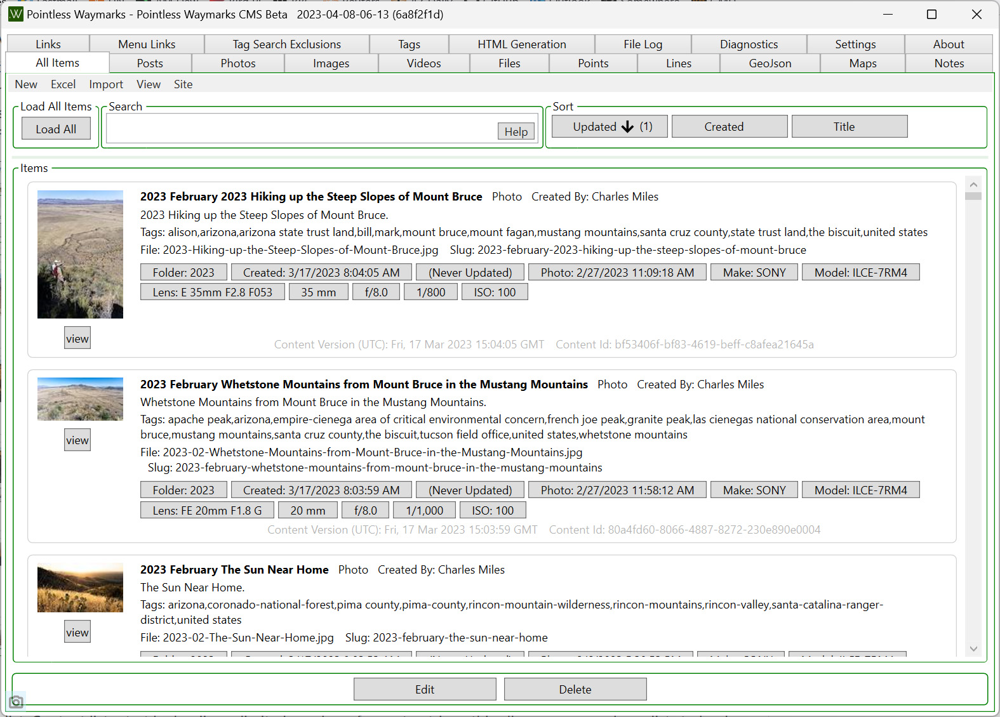
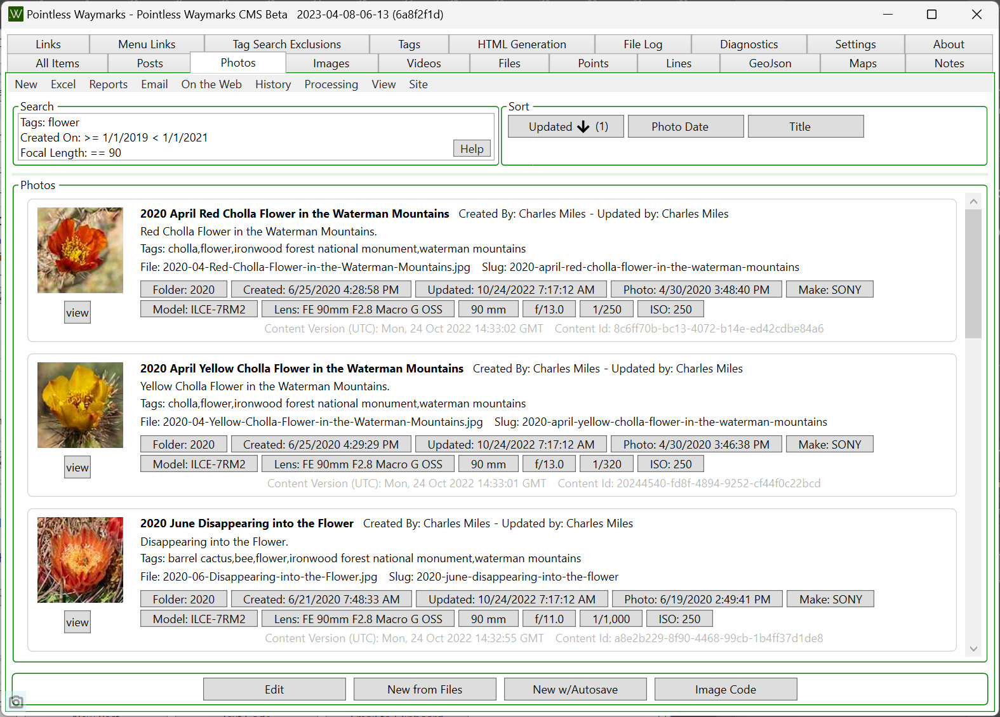

Traditional README information below - the tldr version might be taking a look at [Pointless Waymarks](https://PointlessWaymarks.com) and [cmiles - info](https://www.cmiles.info/) - these sites are managed and generated with the Pointless Waymarks CMS, photos are tagged via the Pointless Waymarks GeoTools, backups managed with Pointless Waymarks Cloud Backup and personal 'Memory' emails are generated with the MemoriesEmail task run via the Pointless Waymarks PowerShell Runner...

# Pointless Waymarks Project

*At this point there are no public installers/releases from the Pointless Waymarks Project - the code is MIT Licensed and public on GitHub to share with friends, colleagues and anyone who finds the code interesting or useful. This project is suitable for use if you enjoy debugging and working on code - scripts to create installers and update support are included in the apps!*

**The Pointless Waymarks Project is a set of applications that are connected by a focus on durable, rich, low maintenance, free, long-lasting, organized, content, stories, photos, location data and minutiae about the landscape, life, place, history and nature -- and by a love of programming, learning, craftsmanship and the joy of creating your own tools!**
  - [Windows Desktop CMS, Static Site Generator, Offline Site Viewer and supporting Command Line Tasks](https://github.com/cmiles/PointlessWaymarksProject) - described below. See [Pointless Waymarks](https://pointlesswaymarks.com/) and [cmiles - info](https://www.cmiles.info/), both sites are created with this system.
  - [Pointless Waymarks GeoTools](https://github.com/cmiles/PointlessWaymarksProject/blob/main/PointlessWaymarks.GeoToolsGui/README.md) - a Windows Desktop program to help with: geotagging Photos (both from gpx files and Garmin Connect), tagging geotagged photos with location information (state, park/monument name, etc) and downloading activities from Garmin Connect.
  - [Pointless Waymarks Cloud Backup](https://github.com/cmiles/PointlessWaymarksProject/blob/main/PointlessWaymarks.CloudBackupGui/README.md) - a data focused Windows backup program that uses Amazon S3, Cloudflare R2 or Wasabi. Features include: MD5 file comparisons, a maximum runtime for backups, Excel reports and easy scheduling via the Windows Task Scheduler. This program does not created versioned backups or have an mechanism to restore your files -> instead it focuses on creating a simple/direct backup of your files on S3/R2 - with your files on S3/R2 you can easily explore your backup on the web or via free clients on nearly any OS and in an emergency there is a very good chance you can find some reasonable way to see/view/access your backups.
  - [Pointless Waymarks Feed Reader](https://github.com/cmiles/PointlessWaymarksProject/blob/main/PointlessWaymarks.FeedReaderGui/README.MD) - a simple Windows Desktop Feed Reader. No folders to organize, no online account and no temptation to doom scroll on your phone - this is a Windows Desktop only program for reading content that you care about with very low setup and ceremony.
  - [Pointless Waymarks PowerShell Runner](https://github.com/cmiles/PointlessWaymarksProject/blob/main/PointlessWaymarks.PowershellRunnerGui/README.md) - a Windows Desktop program to run simple PowerShell scripts. The scripts can be scheduled or run on demand and the output from the runs is recorded (as encrypted text) in a SQLite database for easy review. For me this program replaces Windows Task Scheduler as a nicer way to run simple scheduled jobs including [Cloud Backups](https://github.com/cmiles/PointlessWaymarksProject/blob/main/PointlessWaymarks.CloudBackupGui/README.md), various [Sensor and Data Backups](https://github.com/cmiles/GMH-Backups/tree/main) and the Memories Email Task from this project.

Todo Lists, Idea Lists and a Development Log are [found in a DevNotes.md file that is versioned along with the code](/DevNotes.md).

If you have questions or comments please contact me at pointless@pointlesswaymarks.com.

## Pointless Waymarks CMS

Pointless Waymarks CMS is a .NET Core 9 Windows WPF GUI for generating a static website based on database information and a settings file. It is not an 'all purpose' solution - instead it focuses on:
 - Locally Generated Static Sites - low cost, low maintenance, high durability, easy backup, doesn't have to be on the web to be useful.
 - Database Driven CMS - flexibility in creating and updating content with the potential to generate multiple output formats.
 - Custom Software - optimized support for a limited set of content types and a specific set of workflows.
 - Local/Offline Windows Desktop WPF GUI Editor - no hosting to pay for, no server to maintain, no containers to orchestrate... WPF because it is my favorite Windows GUI technology atm and because the experimentation/learning/coding I do here flows back into my day job where I create and maintain a Retail Inventory Management and Reporting system that has a WPF Front-End.
 - Simple Functional Presentation with a Focus on Content - my experience is that simple presentations of interesting content can survive, have impact and be meaningful for many many years (indefinitely?) without heavy revisions, constant updates or conversion into the latest style/newest framework.

### Launch Screen

Options to launch recent projects or create a new project.

### Content Lists

The first tab in the application is an All Content list. Like all of the lists you can sort and filter to find content and use commands from the menu bar, context menu and quick action buttons to edit, update and create content. The default sorting puts the most recently updated/created items at the top which often means this list is all you need to work efficiently. All lists update automatically in the background to reflect the latest changes.

Each Content Type has a dedicated list that allows access to content-specific commands not available in the All Content list. Content lists start by loading a limited number of recent entries - this allows even very large lists to load quickly with the content that you are most likely to be actively working on. Loading the full list is a single button click.

The ability to export to Excel, edit, and import the changes back into the Pointless Waymarks CMS is provided for all content types and most fields. Many updates are more easily made inside the program but Excel provides a powerful interface for complicated/bulk edits.

Photographs are a central content type and there is support for reading information from the photo's metadata. This often allows the painless import of large batches of photographs with minimal clean up afterwards.

The Photo List supports searching for field like focal length and iso in addition to standard search fields like titles and tag. Photo items have buttons to quickly find similar photos based on details such as Camera Make, Lens, Aperture, Shutter Speed, etc. The Reports menu allows you to quickly find potential problems such as 'No Tags' or 'Blank License' and has an option to export all of a photo's raw metadata to an html file.

A list view of content that has spatial information alonside a map is also available.

### Content Editors

The content editors are intended to be simple, helpful and functional. Change and validation indicators, previews and help with common editing actions are provided. Spatial types - Points, Lines and GeoJson have [Leaflet](https://leafletjs.com/) based previews.

### Tags

Tags are a primary way of connecting and organizing content - a Tag Editor, along with Excel Export/Import, provide support for organizing/correcting/updating tags.

This software has no support for storing completely private content - but it does have support for excluding Tags from the site's various search pages and indicating to search engines not to index excluded Tag Pages. This can be a good way of providing some 'modesty' for tags that you might not want to delete - but that you also don't want to be prominent.

### Menu Links

Content is the focus of this project and admin/widget/header/menu options are intentionally minimal. One of the few options is to use the Menu Links editor to create a very simple menu for the site.

### File Change Tracking

Deploying the site is simply a matter of syncing the content from the generated local site to its destination. To help with that process the program tracks written files and has options to export a list of files, create very basic S3 cli scripts or use the built in S3 uploader. There is also support to detect changed and no longer needed files on S3.

### Feature Intersection Tagging for types with Spatial Data

With some setup involving downloading/creating GeoJson files and putting together a settings file you can tag lines, points and photos with values from GeoJson reference data. This is done by checking for intersections between your downloaded/created reference data and the spatial data from your content - you can specify what property is used to create a Tag.

This certainly doesn't replace tagging 'by hand', but having details like National Forests, National Parks, State Line, National Monuments, State, County, etc. consistently and automatically tagged can be an advantage in organizing your content. In the screen shot below all of the tags were generated by the Feature Intersection Tags feature and data including [PAD-US from the U.S. Geological Survey](https://www.usgs.gov/programs/gap-analysis-project/science/pad-us-data-overview).

See [the Feature Intersection Tags documentation](PointlessWaymarks.FeatureIntersectionTags/README.md) for details.

## (Local, Offline) Site Viewer

A viewer for the on-disk version of the site is available both in the editor and as a stand alone program. This makes it possible to browse your local site without configuring a local web server or publishing your changes. Links to the site are opened in the viewer - external links are opened in your default browser.

One important reason that a local viewer is included is that not all content needs to be online!

## Tasks

Part of the project are a number of 'Tasks' - these are Console Applications that provide extra functionality and are intended to be run thru the Windows Task Scheduler.

### 'Memories' Email

The 'PointlessWaymarks.CmsTask.MemoriesEmail' console app can generate an email with links to items created in previous years on the site. The app is driven by a settings file where you can setup the years back, email settings and what site to get information from. This program can be setup in the Windows Task Scheduler to run daily for fun/interesting emails about past content! [More Information](PointlessWaymarks.CmsTask.MemoriesEmail/README.md)

### Photo Pickup

The 'PointlessWaymarks.CmsTask.PhotoPickup' console app is designed to pickup photographs from a local folder and add them to a site. Setup to run daily in the Windows Task Scheduler this can be an easy way to process a batch of photographs with having to even open the CMS program and combined with a sync program like Dropbox this can be an easy way to add photographs from a mobile device. [More Information](PointlessWaymarks.CmsTask.PhotoPickup/README.md)

### Garmin Connect GPX Import

The 'PointlessWaymarks.CmsTask.GarminConnectGpxImport' console app can download Activitites with location information from Garmin Connect and, optionally, import them into a Pointless Waymarks CMS Site as Line Content. In no way is any part of the Pointless Waymarks Project desgined as a replacement for any part of Garmin Connect - but if you care about the landscape, your history and adventures it is likely worth archiving your Garmin Connect data locally so that you have/own it no matter what happens with Garmin Connect and your Garmin Connect account. This is also an easy way to create Line Content in a Pointless Waymarks CMS site. [More Information](PointlessWaymarks.CmsTask.GarminConnectGpxImport/README.md)

### Publish Site to S3

The 'PointlessWaymarks.CmsTask.PublishSiteToS3' console app detects changes, generates the site and publishes the site to S3 (Amazon S3, Cloudflare R2, Wasabi). [More Information](PointlessWaymarks.CmsTask.PublishSiteToS3/README.md)

## InnoSetup Based Installers and Program Update Notifications

PowerShell Scripts are included that can generate installers for the programs using [Inno Setup](https://jrsoftware.org/isinfo.php). These scripts create the installers with names and inforamtion that the programs are aware of. If you setup the programs to know where the installers are located the programs will check for updates on startup and offer to close the program and start the install. Keeping with the offline first theme of this program - and because there are no current plans for official install packages - this system is designed primarily to work either on your computer or from a file share on your network. These scripts may need some modification for your local environment.

## Password Protected Sites via Cloudflare Workers

Not currently incorporated into the program in any way, but included in this repo, is a simple Cloudflare Worker script for Basic Auth (I have used this successfully for over a year but Cloudflare Workers aren't my current passion so use with caution...). This provides a very simple zero cost (Cloudflare Workers are available on their free plan) way to password protect a site. There is no sense of 'user accounts' or options to change/recover passwords so this is only relevant in limited scenarios, but I have found this to be a nice way to put content online for myself, friends and family without making it public.

## Tools and Libraries

I am incredibly grateful to the all the people and projects that make it possible to rapidly build useful, open, low/no-cost software. Below is a mostly-up-to-date-and-largely-comprehensive list of tools/packages/libraries/etc. that are used to build the this project:

**Tools:**
 - [Visual Studio IDE](https://visualstudio.microsoft.com/), [.NET Core (Linux, macOS, and Windows)](https://dotnet.microsoft.com/download/dotnet-core)
 - [ReSharper: The Visual Studio Extension for .NET Developers by JetBrains](https://www.jetbrains.com/resharper/)
 - [GitHub Copilot · Your AI pair programmer · GitHub](https://github.com/features/copilot)
 - [Metalama: A Framework for Clean & Concise Code in C#](https://www.postsharp.net/metalama)
 - [Xavalon/XamlStyler: Visual Studio extension to help format your XAML source code](https://github.com/Xavalon/XamlStyler)
 - [PowerShell](https://github.com/PowerShell/PowerShell)
 - [tareqimbasher/NetPad: A cross-platform C# editor and playground.](https://github.com/tareqimbasher/NetPad)
 - [dotnet-script/dotnet-script: Run C# scripts from the .NET CLI.](https://github.com/dotnet-script/dotnet-script)
 - [AutoHotkey](https://www.autohotkey.com/)
 - [Beyond Compare](https://www.scootersoftware.com/)
 - [Compact-Log-Format-Viewer: A cross platform tool to read & query JSON aka CLEF log files created by Serilog](https://github.com/warrenbuckley/Compact-Log-Format-Viewer)
 - [DB Browser for SQLite](https://sqlitebrowser.org/)
 - [ExifTool by Phil Harvey](https://exiftool.org/) and [Oliver Betz | ExifTool Windows installer and portable package](https://oliverbetz.de/pages/Artikel/ExifTool-for-Windows)
 - [Fork - a fast and friendly git client for Mac and Windows](https://git-fork.com/)
 - [grepWin: A powerful and fast search tool using regular expressions](https://github.com/stefankueng/grepWin)
 - [Inno Setup](https://jrsoftware.org/isinfo.php)
 - [Greenfish Icon Editor Pro](http://greenfishsoftware.org/gfie.php)
 - [Notepad++](https://notepad-plus-plus.org/)
 - [RegexBuddy: Learn, Create, Understand, Test, Use and Save Regular Expression](https://www.regexbuddy.com/)

 **Data:**
 - [dotnet/efcore: EF Core is a modern object-database mapper for .NET. It supports LINQ queries, change tracking, updates, and schema migrations.](https://github.com/dotnet/efcore)
 - [SQLite](https://www.sqlite.org/index.html) - An absolutely brilliant project - having a Public Domain option for such a high quality data store that can be used locally and cross platform is amazing! Public Domain.
 - [fluentmigrator/fluentmigrator: Fluent migrations framework for .NET](https://github.com/fluentmigrator/fluentmigrator) -  documentation](https://fluentmigrator.github.io/)

 **General:**
 - [commandlineparser/commandline: The best C# command line parser that brings standardized \*nix getopt style, for .NET. Includes F# support](https://github.com/commandlineparser/commandline) - MIT License.
 - [CompareNETObjects](https://github.com/sgray128/Compare-Net-Objects) - Comparison of object properties that stays quick/easy to use but has more options than you would be likely to create with custom reflection code - and potentially more durability than hand coded comparisons. Ms-PL License.
  - [HangfireIO/Cronos: A fully-featured .NET library for working with Cron expressions. Built with time zones in mind and intuitively handles daylight saving time transitions](https://github.com/HangfireIO/Cronos). MIT License.
 - [bradymholt/cron-expression-descriptor: A .NET library that converts cron expressions into human readable descriptions.](https://github.com/bradymholt/cron-expression-descriptor). MIT License.
 - [ButchersBoy/Dragablz: Dragable and tearable tab control for WPF](https://github.com/ButchersBoy/Dragablz) - MIT License.
 - [fluentscheduler/FluentScheduler: Automated job scheduler with fluent interface for the .NET platform.](https://github.com/fluentscheduler/FluentScheduler/tree/version-5) - New BSD License.
 - [GitHub - danm-de/Fractions: A fraction data type to calculate with rational numbers.](https://github.com/danm-de/Fractions) - Used in the Shutter Speed Content List Search - this makes dealing with fractions quite easy! Copyright (c) 2013-2017, Daniel Mueller <daniel@danm.de>. All rights reserved. Redistribution and use in source and binary forms, with or without modification, are permitted provided that the following conditions are met:
     1. Redistributions of source code must retain the above copyright notice, this list of conditions and the following disclaimer.
     2. Redistributions in binary form must reproduce the above copyright notice, this list of conditions and the following disclaimer in the documentation and/or other materials provided with the distribution.
     - THIS SOFTWARE IS PROVIDED BY THE COPYRIGHT HOLDERS AND CONTRIBUTORS ""AS IS"" AND ANY EXPRESS OR IMPLIED WARRANTIES, INCLUDING, BUT NOT LIMITED TO, THE IMPLIED WARRANTIES OF MERCHANTABILITY AND FITNESS FOR A PARTICULAR PURPOSE ARE DISCLAIMED. IN NO EVENT SHALL THE COPYRIGHT HOLDER OR CONTRIBUTORS BE LIABLE FOR ANY DIRECT, INDIRECT, INCIDENTAL, SPECIAL, EXEMPLARY, OR CONSEQUENTIAL DAMAGES (INCLUDING, BUT NOT LIMITED TO, PROCUREMENT OF SUBSTITUTE GOODS OR SERVICES; LOSS OF USE, DATA, OR PROFITS; OR BUSINESS INTERRUPTION) HOWEVER CAUSED AND ON ANY THEORY OF LIABILITY, WHETHER IN CONTRACT, STRICT LIABILITY, OR TORT (INCLUDING NEGLIGENCE OR OTHERWISE) ARISING IN ANY WAY OUT OF THE USE OF THIS SOFTWARE, EVEN IF ADVISED OF THE POSSIBILITY OF SUCH DAMAGE.
 - [IdentityModel/IdentityModel: .NET standard helper library for claims-based identity, OAuth 2.0 and OpenID Connect.](https://github.com/IdentityModel/IdentityModel) - Apache 2.0 License.
 - [rickyah/ini-parser: Read/Write an INI file the easy way!](https://github.com/rickyah/ini-parser) - the ease of working with json makes it quite attractive but it is not as easy to edit by hand as an .ini file imho. MIT License.
 - [PowerShell/PowerShell: PowerShell for every system!](https://github.com/PowerShell/PowerShell) - MIT License.
 - [Microsoft.Recognizers.Text provides recognition and resolution of numbers, units, and date/time expressed in multiple languages](https://github.com/microsoft/Recognizers-Text) - An impressive Date and Time parsing library - the output is detailed and uses generic string/object data types (rather than custom .NET types) so takes some work to parse, but the excellent results and ability to easily recognize when the user has only input a date, or only a time, or both, or a range... is powerful. MIT License.
 - [shrayasr/pinboard.net](https://github.com/shrayasr/pinboard.net/blob/master/LICENSE) - Easy to use wrapper for [Pinboard - 'Social Bookmarking for Introverts'](http://pinboard.in/). MIT License.
 - [bcwood/PressSharper: A C# class library for parsing WordPress XML export data.](https://github.com/bcwood/PressSharper) - the code from PressSharper was pulled into this project, updated for .net5.0, and lightly refactored and reformatted. PressSharper was forked from forked from [dreadwail/press_sharp: A C# class library for parsing Wordpress XML export data.](https://github.com/dreadwail/press_sharp). MIT License.
 - [omuleanu/ValueInjecter: convention based mapper](https://github.com/omuleanu/ValueInjecter) - Quick mapping between objects without any setup needed. MIT License.

**Images:**
 - [mono/taglib-sharp: Library for reading and writing metadata in media files](https://github.com/mono/taglib-sharp) - for reading tags this application uses other libraries - but TagLib# is notable for also writing metadata. LGPL-2.1 license.
 - [GitHub - dimsemenov/PhotoSwipe: JavaScript image gallery for mobile and desktop, modular, framework independent](https://github.com/dimsemenov/PhotoSwipe) - [PhotoSwipe Examples and Documentation](https://photoswipe.com/getting-started/). MIT License.
 - [Raleway - Google Fonts](https://fonts.google.com/specimen/Raleway/about)
 - [drewnoakes/xmp-core-dotnet: .NET library for working with the Extensible Metadata Platform (XMP)](https://github.com/drewnoakes/xmp-core-dotnet/) - The goto C# library if you want to read/write XMP files.
 - [GitHub - miromannino/Justified-Gallery: Javascript library to help creating high quality justified galleries of images.](https://github.com/miromannino/Justified-Gallery). MIT License.
 - [sungaila/PDFtoImage: A .NET library to render PDF files into images.](https://github.com/sungaila/PDFtoImage) - Uses the [pdfium](https://pdfium.googlesource.com/pdfium/) and [SkiaSharp](https://github.com/mono/SkiaSharp) to render PDFs to images. MIT License.

**Wpf:**
 - [dfinke/PowerShellConsole: Create a PowerShell Console using the AvalonEdit control](https://github.com/dfinke/PowerShellConsole/tree/master) - Used code from this project to create an AvalonEdit based PowerShell control for the PowerShell Script Runner Project. Apache License 2.0.
 - [icsharpcode/AvalonEdit: The WPF-based text editor component used in SharpDevelop](https://github.com/icsharpcode/AvalonEdit) - A long lived, powerful, text editor for WPF. MIT license.
 - [dotnet/DataGridExtensions: Modular extensions for the WPF DataGrid control](https://github.com/dotnet/DataGridExtensions) - Easy way to add simple filtering and other features especially to an existing DataGrid. MIT License.
 - [mmanela/diffplex: DiffPlex is Netstandard 1.0+ C# library to generate textual diffs.](https://github.com/mmanela/diffplex/) - Includes a WPF control to display diffs. Apache-2.0 license.
 - [Dirkster99/NumericUpDownLib: Implements numeric up down WPF controls](https://github.com/Dirkster99/NumericUpDownLib) - These up/down controls are missing from WPF - nice to find an updated open source library that provides these! MIT License.
 - [anakic/Jot: Jot is a library for persisting and applying .NET application state.](https://github.com/anakic/Jot) - Used to save application state most prominently main window position.
 - [Kinnara/ModernWpf: Modern styles and controls for your WPF applications](https://github.com/Kinnara/ModernWpf) - MIT License.

**Html:**
 - [chartjs/Chart.js: Simple HTML5 Charts using the canvas tag](https://github.com/chartjs/Chart.js)
 - [arminreiter/FeedReader: C# RSS and ATOM Feed reader library. Supports RSS 0.91, 0.92, 1.0, 2.0 and ATOM. Tested with multiple languages and feeds.](https://github.com/arminreiter/FeedReader)
 - [AngleSharp - Home](https://anglesharp.github.io/) - [AngleSharp/AngleSharp: The ultimate angle brackets parser library parsing HTML5, MathML, SVG and CSS to construct a DOM based on the official W3C specifications.](https://github.com/AngleSharp/AngleSharp) - Mainly used for parsing web pages when creating links. MIT License.
 - [zzzprojects/html-agility-pack: Html Agility Pack (HAP) is a free and open-source HTML parser written in C# to read/write DOM and supports plain XPATH or XSLT. It is a .NET code library that allows you to parse "out of the web" HTML files.](https://github.com/zzzprojects/html-agility-pack) - Used in the Memories email program to parse html. MIT License.
 - [shps951023/HtmlTableHelper: Mini C# IEnumerable object to HTML Table String Library](https://github.com/shps951023/HtmlTableHelper) - used for quick reporting output like the Photo Metadata Dump. MIT License.
 - [HtmlTags/htmltags: Simple object model for generating HTML](https://github.com/HtmlTags/htmltags) - Currently this project uses a combination of T4 templates and tags built by this library to produce HTML. Apache License, Version 2.0.
 - [microsoft/playwright-dotnet: .NET version of the Playwright testing and automation library.](https://github.com/microsoft/playwright-dotnet) - MIT License.
 - [SebastianStehle/mjml-net](https://github.com/SebastianStehle/mjml-net) - An unofficial port of [Mailjet Markup Language](https://mjml.io/) for .NET - this is a good way to ease the pain of building HTML for email. MIT License.

**Testing:**
- [GitHub - adobe/S3Mock: A simple mock implementation of the AWS S3 API startable as Docker image, TestContainer, JUnit 4 rule, JUnit Jupiter extension or TestNG listener](https://github.com/adobe/S3Mock#configuration) - One docker command to have a mock S3 server running and minimal configuration needed for simple cases!!! Apache License, Version 2.0.
- [nunit/nunit: NUnit Framework](https://github.com/nunit/nunit) - MIT License.
